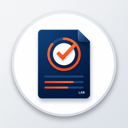

<p align="center">
  
</p>

# CourseWeb LabSheet Tracker

An intelligent browser extension for SLIIT students to automatically track lab sheet submissions and generate professional DOCX templates directly from the CourseWeb portal.

## 🚀 Overview

**CourseWeb LabSheet Tracker** simplifies the process of managing lab submissions by scraping event data from the Moodle-based CourseWeb calendar. It identifies upcoming lab sheet deadlines and provides a one-click solution to generate pre-filled submission templates, saving time and ensuring consistency.

## ✨ Key Features

- **Automated Event Scraping**: Automatically fetches upcoming submission events from the CourseWeb calendar.
- **Smart Filtering**: Specifically identifies "lab sheet" and "practical" submissions using intelligent keyword matching.
- **DOCX Template Generation**: Generates high-quality `.docx` files pre-filled with:
  - Student Name & IT Number (Extracted from profile)
  - Module Code & Name
  - Lab Number
  - Professional SLIIT Branding
- **Batch Processing**: Download all pending lab sheet templates for the month in one click.
- **Persistent Caching**: Uses `chrome.storage` to cache scraped data for lightning-fast performance and offline viewing.
- **Native UI Integration**: Adds a sleek, floating panel directly onto the CourseWeb interface.

## 🛠️ Technology Stack

- **Core**: JavaScript (ES6+), HTML5, CSS3
- **Libraries**:
  - `docx`: For dynamic Word document generation.
  - `file-saver`: For client-side file downloads.
- **APIs**: Chrome Extension API (v3), Moodle Calendar API.

## 📦 Project Structure

```text
├── background.js       # Extension service worker
├── content.js          # Core logic, scraping, and UI rendering
├── content.css         # Styling for the UI panel
├── docx-generator.js   # Logic for assembling the DOCX files
├── docx-bundle.js      # Bundled docx library dependencies
├── manifest.json       # Extension configuration (v3)
├── offscreen.html/js   # Handles document generation in offscreen context
└── icons/              # Extension brand assets
```

## ⚙️ Installation (Developer Mode)

1.  **Clone the repository**:
    ```bash
    git clone https://github.com/ChaturnaK/SLIIT-lab-sheet-generator-extension.git
    ```
2.  **Open Chrome Extensions**: Navigate to `chrome://extensions/`.
3.  **Enable Developer Mode**: Toggle the switch in the top right corner.
4.  **Load Unpacked**: Click "Load unpacked" and select the project directory.

## 📖 Usage

1.  Navigate to [CourseWeb SLIIT](https://courseweb.sliit.lk/).
2.  Log in to your account.
3.  Click the **Lab Tracker** floating button on the right side of the screen.
4.  The panel will open and automatically start syncing your calendar events.
5.  Click the **Download icon** next to any lab event to generate your template!

## 🤝 Contributing

Contributions are welcome! Please feel free to submit a Pull Request.

## 📄 License

This project is licensed under the ISC License.
